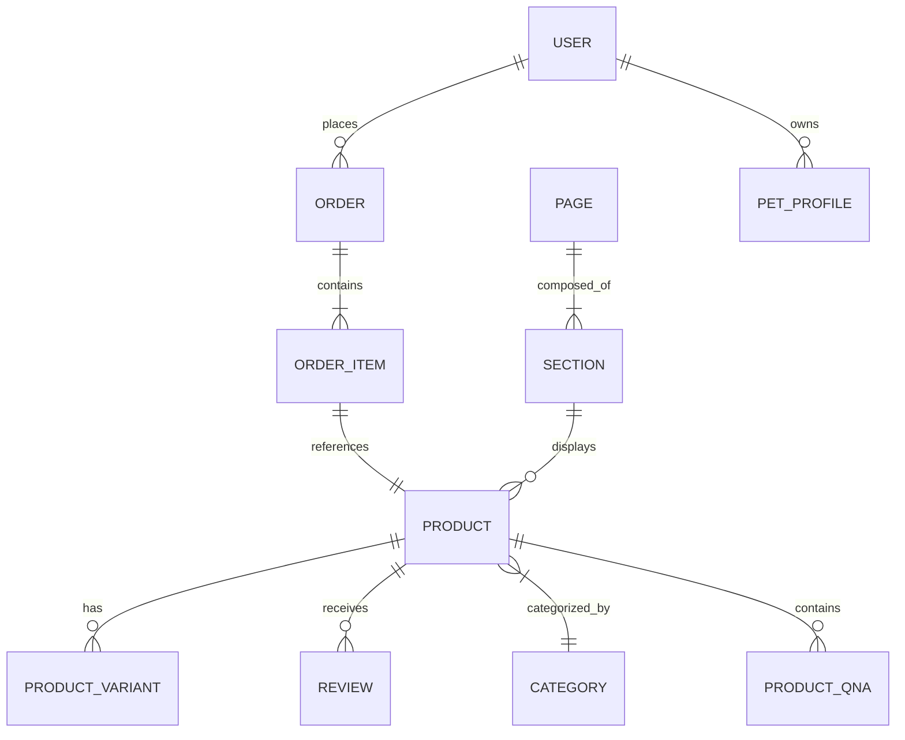

# 🐾 Petco Clone: The Architectural Blueprint

Welcome to the **Petco Clone** Content Engine. This repository houses a sophisticated Sanity Studio v3 implementation, meticulously engineered to mirror a high-scale e-commerce experience with a focus on data integrity, hierarchical taxonomies, and a dynamic page composition system.

---

## 🏗️ Content Architecture

Our schema is built on the principle of **Modular Decoupling** and **Historical Integrity**. Below is a high-level visualization of how our core entities interact:

---

## 💎 Core Domains

### 🛍️ The Product Engine
The heart of the catalog, supporting complex retail requirements:
- **Variants & Options:** Multi-dimensional variants (Size, Color, Flavor) with independent Pricing, SKU, and Stock management.
- **Enriched Attributes:** Deep specifications, feature lists, and pharmacy-specific statuses (Prescription requirements, Dosage forms).
- **Social Proof:** Integrated Review and Q&A systems.
- **Dynamic Delivery:** Granular control over fulfillment (Pickup, Same-Day, Ship-to-Me) with promo badge logic.

### 📦 Order Integrity (The "Snapshot" System)
We solve the "Price Change Paradox" using a custom automation layer:
- **Mutable vs. Immutable:** While Product data lives and changes, **Orders are frozen in time**.
- **Snapshotter Logic:** Our custom `OrderItemSnapshotter` captures the exact Title, Price, SKU, and Image at the moment of selection.
- **Historical Accuracy:** Financial records remain untouched by future catalog updates.

### 🍱 The Page Builder (Block-Based Flex)
A "LEGO-style" assembly system for landing pages and categories:
- **Hero & Contact Units:** High-impact visual headers.
- **Grid Layouts:** Flexible content distribution.
- **Intelligence Factories:** Components like `product-list-factory` that dynamically pull inventory based on rules.
- **SEO & Metadata:** Native integration with SEO objects per page and article.

### 🐕 Pet-Centric Ecosystem
- **Pet Profiles:** Detailed owner-pet relationships supporting personalized experiences (Breed, Life Stage).
- **Services & Memberships:** Managing physical store services (Grooming, Veterinary) and loyalty tiers.
- **Hierarchical Taxonomy:** A 3-tier deep navigation tree: `Category` → `Sub-Category` → `Child Category`.

---

## 🛠️ Specialized Tooling

We extend the Studio with custom React components to handle complex logic where native fields aren't enough:

| Component | Purpose |
| :--- | :--- |
| `OrderItemSnapshotter` | Automates the "Freezing" of product data for orders. |
| `PetTypeInput` | Intuitive selection for pet classification. |
| `CombinationInput` | Visual tool for defining product variant permutations. |
| `OrderItemVariantInput` | Helper for mapping orders to specific variant SKUs. |

---

## 🚀 Deployment & Operations

### Tech Stack
- **Engine:** Sanity Studio v3 (React 19 + TypeScript)
- **Queries:** GROQ with strongly typed TypeGen
- **Package Management:** `pnpm` (Monorepo)

### Development Workflow
1.  **Installation:** `pnpm install` from the root.
2.  **Local Run:** `pnpm dev` (starts Studio at `localhost:3333`).
3.  **Type Safety:** Run `pnpm typegen` whenever schemas change to sync TypeScript interfaces.
4.  **Deployment:** `sanity deploy` to push the latest content model to the cloud.

---

> [!TIP]
> **Pro-Tip:** All internal logic follows the "Sanity Best Practices" skill set, ensuring performance and visual editing compatibility.

---
© 2026 Petco Clone Engineering Team. All rights reserved.
