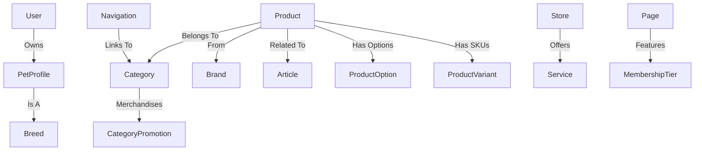

# Petco Clone: Sanity Studio Architecture

This document explains the data model, relationships, and business logic for the Sanity-powered Petco clone.

---

## 1. Core Product & Commerce
At the center of the ecosystem is the **Product**. It connects to categorization, branding, and pharmacy.

### Key Relations:
- **Product → Category**: Products are linked to a `Main Category`, `Sub Category`, and `Child Category` for deep filtering.
- **Product → Brand**: Every product belongs to a Brand document.
- **Product → Articles**: Products can reference educational articles (e.g., a specific dog food referencing an article on "Puppy Nutrition").
- **Product → Variants**: A Product can define multiple `Options` (Size, Color), which combine into `Variants` representing actual purchasable SKUs with dedicated pricing and inventory.
- **Product → Delivery**: Delivery methods allow dynamic rendering of promotional badges (e.g., "Free Same-Day Delivery") driven by product configuration.
- **Category → Promotions**: Categories manage their own merchandising through promotional sections like Trending, Best Sellers, and Customers Also Bought using the `categoryPromotion` object.
- **Product → Reviews/Q&A**: Nested arrays of objects for customer interaction.

---

## 2. The "Shop by Pet" Logic
Unlike standard e-commerce, Petco is pet-centric. We've implemented `petType` across three layers:
1.  **Product**: Has a `petType` (Dog, Cat, etc.).
2.  **Category**: Has a `petType`. *Example: "Food" category with `petType: dog` creates the "Dog Food" section.*
3.  **Brand**: Has a `petTypes` array. *Example: Purina is linked to both Dog and Cat.*

---

## 3. Physical Experience (Stores & Services)
This section handles the O2O (Online to Offline) experience.

### Key Relations:
- **Store → Service**: The `store` document contains a `servicesAvailable` array of references to `service` documents.
- **Service**: A standalone document (Grooming, Vet, Training) that describes the offering.
- **Store → Geopoint**: Used for the frontend "Store Locator" map.

---

## 4. User & Pet Profiles
This is the personalization engine.

### Key Relations:
- **User → Pet Profiles**: A User document contains an array of `petProfile` objects.
- **Pet Profile → Breed**: Each pet profile references a `breed` document.
- **Smart Filtering**: The `breed` reference in a Pet Profile is filtered by the Pet Profile's `petType` (e.g., if the pet is a "Cat", the UI only shows Cat breeds).

---

## 5. Membership (Vital Care)
Manages the tiered subscription model.

### Key Relations:
- **Membership Tier**: Standalone document defining price, benefits, and branding colors.
- **Page Builder → Membership**: The `membershipSection` in the page builder allows marketing teams to drop "Vital Care" promotions onto any landing page by referencing these tiers.

---

## 6. Page Builder & Navigation
The "Lego" system for building the frontend.

### Key Relations:
- **Page → Section**: A `page` document is a collection of `pageBuilder` sections (Hero, Grid, Product List, etc.).
- **Navigation**: A singleton document that defines the Mega-Menu. It supports:
    - Nested links (3 levels deep).
    - Featured Promotions (Image + Link) inside the menu itself.

---

## Relationship Diagram (Conceptual)

---

## 7. Dummy Data Migration
To populate this structure, run:
`npx sanity@latest exec migrations/import-petco-data.ts --with-user-token`
